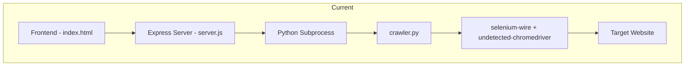
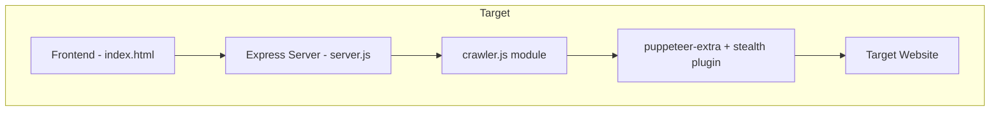

# Python to Node.js Web Scraper Conversion Plan

## Overview

This document outlines the plan to convert the Python web scraper (`crawler.py`) to Node.js while maintaining complete functional parity.

## Current Architecture



## Target Architecture



## Files to Create/Modify

| File | Action | Description |
|------|--------|-------------|
| `crawler.js` | CREATE | New Node.js crawler with Puppeteer |
| `server.js` | MODIFY | Import crawler module directly instead of spawning Python |
| `package.json` | MODIFY | Add puppeteer-extra, stealth plugin, and test dependencies |
| `Dockerfile` | REPLACE | Minimal Node.js + Chrome image |
| `test/crawler.test.js` | CREATE | Integration test suite |
| `cleanup-python.sh` | CREATE | Script to remove Python files |
| `README.md` | CREATE | Migration documentation |

## Detailed Component Mapping

### 1. crawler.js - Core Scraper Module

#### Python to Node.js Function Mapping

| Python Function | Node.js Equivalent |
|-----------------|-------------------|
| `human_delay(min_ms, max_ms)` | `async humanDelay(minMs, maxMs)` |
| `human_type(element, text)` | `async humanType(page, selector, text)` |
| `is_cloudflare_challenge(driver)` | `async isCloudflareChallenge(page)` |
| `verify_proxy_ip(driver, debug_info)` | `async verifyProxyIp(page, debugInfo)` |
| `lookup_insurance_group(registration)` | `async lookupInsuranceGroup(registration)` |
| `main(registration)` | `async main(registration)` - with retry logic |

#### Configuration Constants

```javascript
// Same as Python
const TARGET_URL = 'https://www.moneysupermarket.com/car-insurance/car-insurance-group-checker-tool/';

const USER_AGENTS = [
    'Mozilla/5.0 (Windows NT 10.0; Win64; x64) AppleWebKit/537.36 (KHTML, like Gecko) Chrome/120.0.0.0 Safari/537.36',
    'Mozilla/5.0 (Windows NT 10.0; Win64; x64) AppleWebKit/537.36 (KHTML, like Gecko) Chrome/121.0.0.0 Safari/537.36',
    'Mozilla/5.0 (Windows NT 10.0; Win64; x64) AppleWebKit/537.36 (KHTML, like Gecko) Chrome/122.0.0.0 Safari/537.36',
    'Mozilla/5.0 (Windows NT 10.0; Win64; x64) AppleWebKit/537.36 (KHTML, like Gecko) Chrome/123.0.0.0 Safari/537.36',
    'Mozilla/5.0 (Macintosh; Intel Mac OS X 10_15_7) AppleWebKit/537.36 (KHTML, like Gecko) Chrome/120.0.0.0 Safari/537.36',
    'Mozilla/5.0 (Macintosh; Intel Mac OS X 10_15_7) AppleWebKit/537.36 (KHTML, like Gecko) Chrome/121.0.0.0 Safari/537.36',
];

const SCREEN_SIZES = [
    [1920, 1080],
    [1366, 768],
    [1536, 864],
    [1440, 900],
    [1680, 1050],
];
```

#### Proxy Configuration

```javascript
// Environment variables (same as Python)
const proxyHost = process.env.PROXY_HOST || '';
const proxyPort = process.env.PROXY_PORT || '';
const proxyUser = process.env.PROXY_USER || '';
const proxyPass = process.env.PROXY_PASS || '';

// Puppeteer proxy setup
const launchArgs = [];
if (proxyHost && proxyPort) {
    launchArgs.push(`--proxy-server=http://${proxyHost}:${proxyPort}`);
}

// Authentication via page.authenticate()
if (proxyUser && proxyPass) {
    await page.authenticate({
        username: proxyUser,
        password: proxyPass
    });
}
```

#### Cloudflare Detection

```javascript
async function isCloudflareChallenge(page) {
    const title = await page.title().catch(() => '');
    const bodyText = await page.$eval('body', el => el.innerText.slice(0, 2000)).catch(() => '');
    
    const indicators = [
        'just a moment',
        'checking your browser',
        'please wait',
        'ddos protection',
        'cloudflare',
        'ray id',
        'enable javascript',
        'attention required',
        'security check',
    ];
    
    const lowerTitle = title.toLowerCase();
    const lowerBody = bodyText.toLowerCase();
    
    return indicators.some(indicator => 
        lowerTitle.includes(indicator) || lowerBody.includes(indicator)
    );
}
```

#### Selector Strategy (Same as Python)

**Input selectors:**
```javascript
const inputSelectors = [
    'input[data-testid="vrm-input"]',
    'input[name="vrm"]',
    'input[name="registration"]',
    'input[id="vrm"]',
    'input[placeholder*="registration" i]',
    'input[type="text"][maxlength]',
];
```

**Cookie button selectors:**
```javascript
const cookieSelectors = [
    'button:has-text("Accept all")',
    'button:has-text("Accept")',
    '#onetrust-accept-btn-handler',
];
```

**Submit button selectors:**
```javascript
const buttonSelectors = [
    'button[data-testid="vrm-submit"]',
    'button:has-text("Find insurance group")',
    'button:has-text("Find")',
    'button[type="submit"]',
];
```

#### Data Extraction Patterns

```javascript
const patterns = [
    /Your car insurance group[^\d]*Group\s+(\d+)\s*\/\s*(\d+)/i,
    new RegExp(`\\(${registration}\\)[^\\d]*Group\\s+(\\d+)\\s*/\\s*(\\d+)`, 'i'),
    /Group\s+(\d+)\s*\/\s*(\d+)/i,
];
```

#### Output Structure (Identical to Python)

**Success:**
```json
{
    "success": true,
    "registration": "AB12CDE",
    "insuranceGroup": 15,
    "maxGroup": 50,
    "displayText": "Group 15/50"
}
```

**Error:**
```json
{
    "success": false,
    "error": "Error message",
    "registration": "AB12CDE",
    "debug": ["Debug message 1", "Debug message 2"],
    "cloudflare_blocked": true,
    "pageTitle": "Page title",
    "pageTextSample": "First1500 chars..."
}
```

### 2. server.js Changes

**Before:**
```javascript
const { spawn } = require('child_process');
// Spawns Python subprocess for each request
const py = spawn(pythonBin, ['crawler.py', cleanReg], { env });
```

**After:**
```javascript
const { lookupInsuranceGroup } = require('./crawler');
// Direct function call
const result = await lookupInsuranceGroup(cleanReg);
res.json(result);
```

### 3. package.json Dependencies

**New dependencies:**
```json
{
    "dependencies": {
        "cors": "^2.8.5",
        "dotenv": "^16.3.1",
        "express": "^5.2.1",
        "puppeteer": "^22.0.0",
        "puppeteer-extra": "^3.3.6",
        "puppeteer-extra-plugin-stealth": "^2.11.2"
    },
    "devDependencies": {
        "nodemon": "^3.1.11",
        "jest": "^29.7.0"
    }
}
```

### 4. Minimal Dockerfile

```dockerfile
FROM node:20-bookworm

# Install Chrome dependencies
RUN apt-get update && apt-get install -y \
    chromium \
    fonts-liberation \
    libnss3 \
    libxss1 \
    libasound2 \
    libatk-bridge2.0-0 \
    libgtk-3-0 \
    --no-install-recommends \
    && rm -rf /var/lib/apt/lists/*

WORKDIR /app

COPY package*.json ./
RUN npm ci --only=production

COPY . .

ENV NODE_ENV=production
ENV PUPPETEER_SKIP_CHROMIUM_DOWNLOAD=true
ENV PUPPETEER_EXECUTABLE_PATH=/usr/bin/chromium

EXPOSE 3001
CMD ["node", "server.js"]
```

### 5. Integration Tests

```javascript
// test/crawler.test.js
const { lookupInsuranceGroup } = require('../crawler');

describe('Insurance Group Lookup', () => {
    jest.setTimeout(60000); // 60 second timeout for browser operations
    
    test('should return success for valid registration', async () => {
        const result = await lookupInsuranceGroup('AB12CDE');
        
        if (result.success) {
            expect(result).toHaveProperty('insuranceGroup');
            expect(result).toHaveProperty('maxGroup');
            expect(result).toHaveProperty('displayText');
            expect(typeof result.insuranceGroup).toBe('number');
        } else {
            // May fail due to Cloudflare or network issues
            expect(result).toHaveProperty('error');
        }
    });
    
    test('should return consistent output structure', async () => {
        const result = await lookupInsuranceGroup('TEST123');
        
        expect(result).toHaveProperty('success');
        expect(result).toHaveProperty('registration');
        if (!result.success) {
            expect(result).toHaveProperty('error');
        }
    });
});
```

### 6. Cleanup Script

```bash
#!/bin/bash
# cleanup-python.sh

echo "Removing Python crawler files..."

# Remove Python file
rm -f crawler.py

# Remove Python cache
rm -rf __pycache__

echo "Python files removed successfully."
echo ""
echo "Note: The following files are preserved:"
echo "  - .env (configuration)"
echo "  - public/ (frontend)"
echo "  - README.md (documentation)"
```

## Implementation Order

1. **Create `crawler.js`** - Complete Node.js implementation
2. **Update `package.json`** - Add dependencies
3. **Update `server.js`** - Import and use crawler module
4. **Create `Dockerfile`** - Minimal Node.js + Chrome
5. **Create `test/crawler.test.js`** - Integration tests
6. **Test locally** - Verify functionality matches Python
7. **Create `cleanup-python.sh`** - Removal script
8. **Create `README.md`** - Document the migration

## Risk Mitigation

| Risk | Mitigation |
|------|------------|
| Cloudflare detection differences | puppeteer-extra-plugin-stealth provides similar anti-detection as undetected-chromedriver |
| Proxy authentication issues | Use `page.authenticate()` before navigation |
| Selector timing differences | Use `waitForSelector` with appropriate timeouts |
| Different error handling | Match Python's exception handling pattern exactly |

## Validation Criteria

- [ ] Successful lookup returns identical JSON structure
- [ ] Error responses match Python format
- [ ] Proxy IP verification works
- [ ] Cloudflare detection and waiting works
- [ ] Human-like delays are applied
- [ ] Cookie consent is handled
- [ ] Retry logic works for Cloudflare blocks
- [ ] Docker container runs successfully