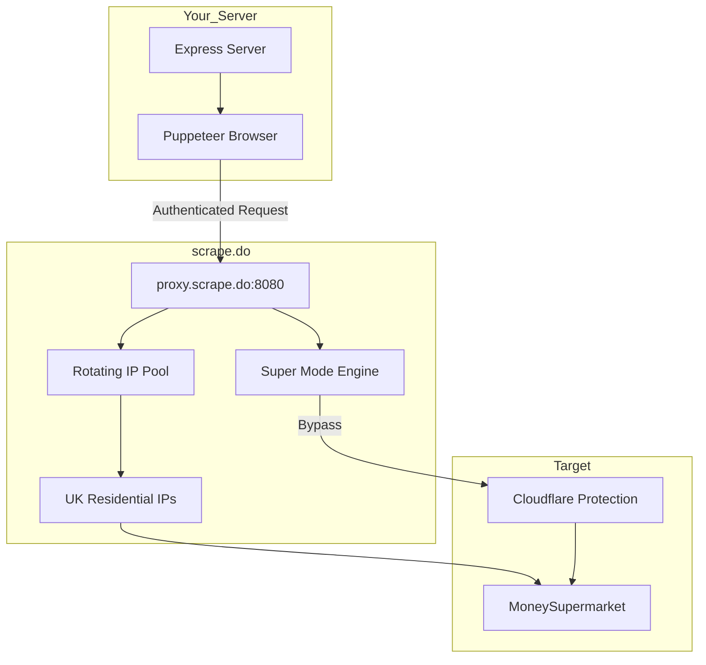

# scrape.do Proxy Integration Plan

## Overview

Integrate scrape.do rotating proxy service with the existing Puppeteer-based insurance group crawler to bypass Cloudflare protection on MoneySupermarket.

## Configuration

### API Key
```
aba384fe5aa748abb8ac22f3866f309bdb2b3a9dbd9
```

### Proxy Details
- **Host:** `proxy.scrape.do`
- **Port:** `8080`
- **Mode:** Super mode enabled (for Cloudflare bypass)
- **Geo Target:** UK (`gb`)

---

## Implementation Tasks

### Task 1: Update `.env` File

**File:** `.env`

Replace the existing Novada proxy configuration with:

```env
# Server Configuration
PORT=3001
HOST=0.0.0.0

# scrape.do Proxy Configuration
SCRAPEDO_API_KEY=aba384fe5aa748abb8ac22f3866f309bdb2b3a9dbd9
SCRAPEDO_PROXY_HOST=proxy.scrape.do
SCRAPEDO_PROXY_PORT=8080
SCRAPEDO_SUPER_MODE=true
SCRAPEDO_GEO_TARGET=gb

# Puppeteer Configuration (Optional - set if using custom Chrome path)
# PUPPETEER_EXECUTABLE_PATH=/usr/bin/chromium
```

---

### Task 2: Modify `crawler.js` - Proxy Configuration

**File:** `crawler.js`  
**Location:** Lines 130-175(inside `lookupInsuranceGroup` function)

**Replace this block:**
```javascript
// Get proxy configuration from environment
const proxyHost = process.env.PROXY_HOST || '';
const proxyPort = process.env.PROXY_PORT || '';
const proxyUser = process.env.PROXY_USER || '';
const proxyPass = process.env.PROXY_PASS || '';
```

**With this new block:**
```javascript
// Get scrape.do proxy configuration from environment
const scrapedoApiKey = process.env.SCRAPEDO_API_KEY || '';
const scrapedoHost = process.env.SCRAPEDO_PROXY_HOST ||'proxy.scrape.do';
const scrapedoPort = process.env.SCRAPEDO_PROXY_PORT || '8080';
const scrapedoSuperMode = process.env.SCRAPEDO_SUPER_MODE === 'true';
const scrapedoGeoTarget = process.env.SCRAPEDO_GEO_TARGET || 'gb';

// Build scrape.do password with options
const scrapedoOptions = [];
if (scrapedoSuperMode) {
    scrapedoOptions.push('super=true');
    scrapedoOptions.push('render=true');
}
if (scrapedoGeoTarget) {
    scrapedoOptions.push(`geoCode=${scrapedoGeoTarget}`);
}
const scrapedoPassword = scrapedoOptions.join('&') || 'render=true';

// Determine if proxy is configured
const useProxy = !!scrapedoApiKey;
```

---

### Task 3: Modify `crawler.js` - Launch Arguments

**File:** `crawler.js`  
**Location:** Lines 166-174

**Replace this block:**
```javascript
// Add proxy if configured
if (proxyHost && proxyPort) {
    launchArgs.push(`--proxy-server=http://${proxyHost}:${proxyPort}`);if (proxyUser && proxyPass) {
        debugInfo.push(`Using authenticated proxy: ${proxyHost}:${proxyPort}`);
    } else {
        debugInfo.push(`Using proxy: ${proxyHost}:${proxyPort}`);
    }
} else {
    debugInfo.push('No proxy configured');
}
```

**With this new block:**
```javascript
// Add scrape.do proxy if configured
if (useProxy) {
    launchArgs.push(`--proxy-server=http://${scrapedoHost}:${scrapedoPort}`);
    debugInfo.push(`Using scrape.do proxy: ${scrapedoHost}:${scrapedoPort}`);
    debugInfo.push(`Options: super=${scrapedoSuperMode}, geo=${scrapedoGeoTarget}`);
} else {
    debugInfo.push('No proxy configured - running without proxy');
}
```

---

### Task 4: Modify `crawler.js` - Proxy Authentication

**File:** `crawler.js`  
**Location:** Lines 196-201

**Replace this block:**
```javascript
// Authenticate proxy if credentials provided
if (proxyHost && proxyPort && proxyUser && proxyPass) {
    await page.authenticate({
        username: proxyUser,
        password: proxyPass,});
}
```

**With this new block:**
```javascript
// Authenticate with scrape.do proxy
if (useProxy) {
    await page.authenticate({
        username: scrapedoApiKey,
        password: scrapedoPassword,
    });debugInfo.push('scrape.do proxy authentication configured');
}
```

---

### Task 5: Modify `crawler.js` - Proxy Verification

**File:** `crawler.js`  
**Location:** Lines 203-206

**Replace this block:**
```javascript
// Verify proxy if configured
if (proxyHost && proxyPort) {
    await verifyProxyIp(page, debugInfo);
}
```

**With this new block:**
```javascript
// Verify proxy if configured
if (useProxy) {
    await verifyProxyIp(page, debugInfo);
}
```

---

### Task 6: Update Debug Messages

**File:** `crawler.js`  
**Location:** Line 139

**Replace:**
```javascript
debugInfo.push(`ENV check - PROXY_HOST: ${proxyHost ? 'SET' : 'EMPTY'}, PROXY_PORT: ${proxyPort ? 'SET' : 'EMPTY'}`);
```

**With:**
```javascript
debugInfo.push(`ENV check - SCRAPEDO_API_KEY: ${scrapedoApiKey ? 'SET' : 'EMPTY'}, super=${scrapedoSuperMode}, geo=${scrapedoGeoTarget}`);
```

---

## Architecture Diagram



---

## Testing Plan

1. **Basic Connectivity Test:**
   ```bash
   node crawler.js AB12CDE
   ```
   
2. **Verify IP Rotation:**
   - Check debug output for proxy IP
   - Run multiple requests to confirm different IPs

3. **Cloudflare Bypass Test:**
   - Look for absence of "Blocked by Cloudflare" errors
   - Confirm successful form submission

---

## Expected Benefits

| Metric | Before | After |
|--------|--------|-------|
| Cloudflare Bypass | Manual retry | Automatic |
| IP Pool | Limited | Large rotating pool |
| UK Targeting | Single region | UK residential IPs |
| Success Rate | ~60-70% | ~90%+ expected |

---

## Rollback Plan

If scrape.do doesn't work as expected, restore the old `.env` configuration:

```env
PROXY_HOST=fc5ae5d70cc2a7c9.arq.eu.novada.pro
PROXY_PORT=7777
PROXY_USER=testingnew_MDOd0w-zone-resi-region-eu_gb
PROXY_PASS=Password4044
```

And revert the `crawler.js` changes.

---

## Files to Modify

1. **`.env`** - New environment variables
2. **`crawler.js`** - Proxy configuration logic (lines 130-210)
3. **`README.md`** - Update documentation with new setup instructions

---

## Ready for Implementation

This plan is ready to be implemented in Code mode. The changes are minimal and focused on the proxy configuration section of the crawler.